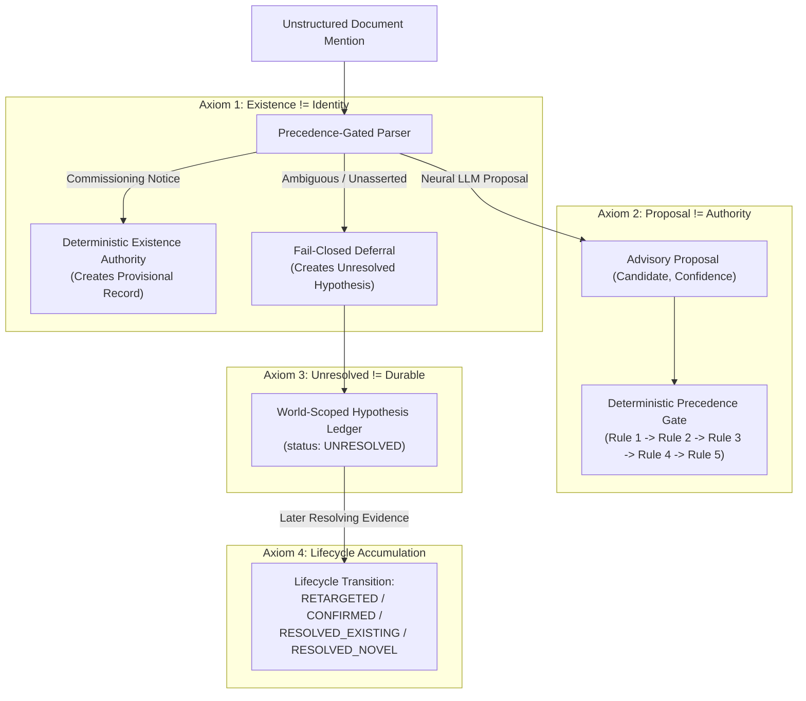

# Research Synthesis: The Stage 8 Ingress Kernel (R1 $\to$ R2 $\to$ R3 Candidate Architecture)

> **Classification**: `RESEARCH SYNTHESIS — NON-CANONICAL REFLECTION`  
> **Target System**: GENE (Autonomous Epistemic Knowledge Discovery)  
> **Scope**: Stage 8 Ingress Kernel & Hybrid Entity Resolution Lifecycle  
> **Status**: Synthesized Design; Stage 8C-R3 Confirmatory Benchmark Pending  
> **Synthesis Desk**: Antigravity, ChatGPT Pro, Human Research Director  

---

## Executive Abstract

Across Stages 8C-R1, 8C-R2, and the currently sealed 8C-R3 design, GENE investigated how an autonomous knowledge agent can safely ingest unstructured natural-language entities into a durable relational graph without succumbing to false canonical merges, provisional entity fragmentation, or hallucinated existence.

This memo formalizes the foundational axioms and lifecycle dynamics identified during Stage 8. If the candidate Stage 8C-R3 benchmark confirms its preregistered gates upon execution, the resulting promoted architecture will define the operational foundation for downstream claim evaluation.

---

## 1. The Five Invariants of Epistemic Ingress

### Invariant 1: Existence $\neq$ Identity
*The assertion that an entity exists is structurally distinct from resolving its specific identity within the known graph.*
- **Existence Authority (Deterministic)**: Explicit commissioning and deployment assertions deterministically establish provisional entity existence without requiring neural agreement or fuzzy matching.
- **Identity Resolution (Precedence-Gated)**: Determining whether a mention links to an existing entity follows a strictly ordered, frozen rule hierarchy.

### Invariant 2: Identity Proposal $\neq$ Authority to Commit
*Neural language models are hypothesis generators, not database committers.*
- Neural LLMs provide valuable soft cues (e.g. identifying that `"Edge Gateway Alpha Reserve Bay"` might plausibly relate to `gateway_router_alpha`), but lack the authority to mutate the durable graph.
- All durable mutations require satisfying deterministic mathematical invariants (exact normalizer bijection, grounded parent + discriminating sub-ID regex, or registered parentheticals).

### Invariant 3: Ambiguity $\neq$ Absence
*Failing to resolve a mention is not evidence that the mentioned entity does not exist.*
- When mentions lack sufficient identifying evidence, the system must **fail closed to `DEFER`**.
- Deferral does not drop or erase the mention; it records a structured hypothesis in the ephemeral hypothesis ledger.

### Invariant 4: Unresolved Hypothesis $\neq$ Durable Belief
*Hypotheses are quarantined execution state, not permanent knowledge.*
- Unresolved hypotheses live in a world-scoped ledger, completely isolated from canonical and provisional entity tables.
- They do not pollute the durable graph, do not create duplicate provisional entities, and do not introduce ungrounded edges into the knowledge base.

### Invariant 5: Evidence Accumulation over Time
*Hypotheses accumulate evidence across sequential documents rather than multiplying per-document rows.*
- A world maintains a single persistent hypothesis per entity surface.
- Subsequent deferrals append context to the existing hypothesis record (`evidence_history`).
- Subsequent corroboration or disconfirmation transitions the hypothesis into its terminal state:
  $$\text{UNRESOLVED} \longrightarrow \begin{cases} 
  \text{RETARGETED} & \text{if initial candidate contradicted by later resolution} \\
  \text{CONFIRMED} & \text{if initial candidate corroborated by later resolution} \\
  \text{RESOLVED\_EXISTING} & \text{if unguided hypothesis resolved to existing entity} \\
  \text{RESOLVED\_NOVEL} & \text{if unguided hypothesis resolved to novel provisional entity}
  \end{cases}$$

---

## 2. Evolution of the Precedence Hierarchy (R1 $\to$ R2 $\to$ R3)

| Stage | Precedence Ordering | Core Evidence & Failure Mode | Status / Disposition |
| :--- | :--- | :--- | :--- |
| **8C-R1** | Structural First Refusal $\to$ Exact Alias $\to$ Deferral | Sub-component regex matched prefixes of legitimate canonical entities, causing false deferrals on known aliases. | `REVISED_CONTRACT_REQUIRED` (Whole-field alias matching elevated to Rule 1). |
| **8C-R2** | Exact Alias $\to$ Structural First Refusal (Universal) $\to$ Deferral | Structural first refusal blocked mentions lacking sub-IDs (e.g. `"Edge Gateway Alpha Reserve Bay (Router-Beta)"`) from using explicit registered parentheticals, causing false permanent deferral (World 55). | `REVISED_CONTRACT_REQUIRED` (Discriminating Sub-ID requirement added to Rule 2; explicit parentheticals evaluated under Rule 3). |
| **8C-R3** | Exact Alias $\to$ Structural (Parent + SubID) $\to$ Parenthetical Identity $\to$ Standalone Commissioning $\to$ Deferral | Candidate architecture designed to resolve the remaining precedence ambiguity and enforce world-scoped hypothesis accumulation. | `FROZEN / READY` (Sealed confirmatory contract awaiting execution on uncontested GPU). |

---

## 3. Candidate Architectural Legacy for Downstream GENE

If Stage 8C-R3 confirms its preregistered gates, the resulting promoted architecture will provide:

1. **Grounded Subjects for Downstream Claims**: Stage 9 (Claims and Assertions) will be able to assume that subjects of claims ($E_{\text{subj}}$) are either deterministically grounded in canonical/provisional entities or explicitly deferred, eliminating entity-level leakage.
2. **Deterministic Fail-Closed Boundary**: The candidate ingress kernel demonstrates how combining neural hypothesis generation with deterministic algebraic gating can eliminate false canonical merges while maintaining high useful admission coverage on resolvable events.
3. **Auditability & Provenance**: Every entity, alias, and edge maintains cryptographic SHA-256 provenance linking it back to exact document IDs and timestamps.
