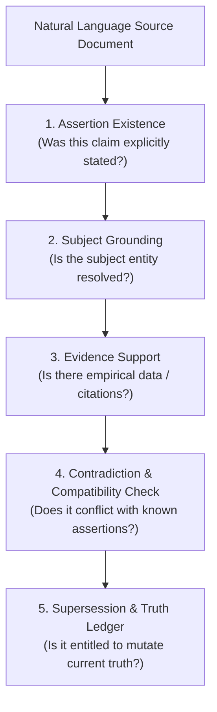
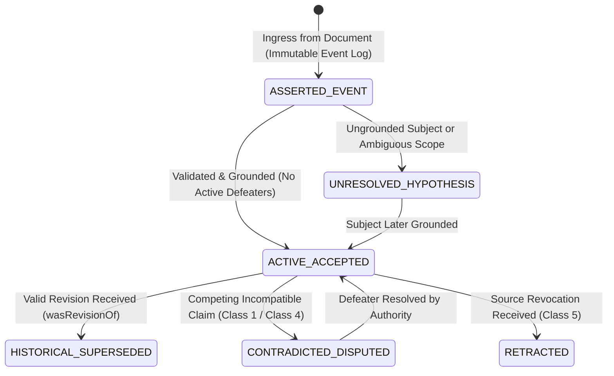

# Research Packet: Stage 9 Epistemic Horizon (Claims, Evidence, Contradiction & Supersession)

> **Classification**: `NON-CANONICAL RESEARCH PACKET — QUESTIONS & ARCHITECTURAL EXPLORATION ONLY`  
> **Target System**: GENE (Autonomous Epistemic Knowledge Discovery)  
> **Status**: Exploratory Design (No Frozen Contract, No Schema Implementation)  
> **Authors**: Antigravity, ChatGPT Pro, Human Research Director  

---

## Executive Summary

Stage 8 has converged on a candidate **Ingress Kernel**, with final R3 confirmatory evidence pending.  
Stage 9 addresses the next altitude of the GENE Moonshot: **Claims and Assertions** ("What is being claimed about these entities, and what is that claim entitled to change?").

This research packet formalizes the conceptual questions, epistemic invariants, contradiction taxonomy, and temporal semantics necessary to design Stage 9 safely without pre-committing to rigid implementations.

---

## 1. The Core Invariants of Claim Epistemics

At the entity level, Stage 8 proved that $\text{Existence} \neq \text{Identity}$.  
At the claim level, Stage 9 establishes a four-tier decoupling:

$$\text{Assertion Existence} \neq \text{Claim Truth} \neq \text{Belief Authority} \neq \text{Supersession Authority}$$



### The Five Epistemic Distinctions

1. **Was the claim asserted $\neq$ Is its subject grounded?**
   - A document can state: *"The experimental tier router has 400 Gbps throughput."*
   - The assertion is undeniably present in the document, but if `"The experimental tier router"` cannot be resolved to a canonical or provisional entity, the claim cannot mutate the durable property graph. It must attach to an *unresolved claim hypothesis*.

2. **Is the claim supported $\neq$ Is it contradicted?**
   - A claim can be thoroughly supported by local benchmark charts within Paper A, while simultaneously being contradicted by global empirical results in Paper B.
   - Support and Contradiction are independent evidential dimensions, not binary opposites.

3. **Is a newer claim different $\neq$ Does it supersede the prior claim?**
   - A newer document stating a different value (e.g. `latency = 12ms` vs `latency = 5ms`) is not automatically a supersession.
   - It may reflect different test harnesses, different benchmark suites, temporary degradation, or a distinct hardware revision.

4. **Does an old claim stop being current $\neq$ Should its history be deleted?**
   - When a claim is superseded (e.g. an updated system configuration replaces an older one), the prior claim is marked `HISTORICAL_SUPERSEDED`, never deleted.
   - Complete provenance and historical lineage are preserved indefinitely for retrospective auditing.

5. **Disagreement between sources $\neq$ Direct logical contradiction.**
   - Two independent research groups reporting different accuracy numbers for the same model architecture does not mean one is fraudulent or broken; it may reflect training seed variance, differing hardware architectures, or undocumented hyperparameters.

---

## 2. Deep Epistemic Formalism: The Tripartite State Model

A central challenge in knowledge representation is formalizing the difference between three distinct states:
1. **Assertion Layer**: *"An assertion was made by Source $S$ at timestamp $T$."*
2. **Current Belief Layer**: *"We currently accept this assertion as an active fact about Entity $E$."*
3. **Historical Lineage Layer**: *"We once accepted this assertion, but it was subsequently superseded by Assertion $A'$ or refuted by Evidence $E'$."*



### The Unification of Event Sourcing, Bitemporality, and Argumentation
To represent these three tiers without ad-hoc flag hacking, GENE unifies three established formalisms:
1. **Event Sourcing (Immutable Append-Only Log)**: Every document ingress creates an immutable `AssertionEvent` that can never be updated or deleted.
2. **Bitemporal Relational State**: Facts are indexed by both **Valid Time** (when true in the world) and **Transaction Time** (when recorded in the graph).
3. **Dung-Style Abstract Argumentation Frameworks (1995)**: An active belief is an argument whose justifications are not currently defeated by an active contradiction or superseding revision.

---

## 3. Adversarial Taxonomy of Contradiction Classes

```text
Contradiction Taxonomy
├── 1. Direct Logical Conflict        (Same scope, same time, opposing truth polarity)
├── 2. Temporal State Transition     (Valid update over time: 2025: 8 GPUs -> 2026: 16 GPUs)
├── 3. Scope / Condition Divergence  (Different workloads, temperatures, batch sizes)
├── 4. Epistemic Disagreement        (Competing peer claims under identical conditions)
├── 5. Retraction / Correction       (Explicit revocation by originating author)
└── 6. Corroborative Paraphrase      (Independent paper merely echoing an older claim)
```

| Class | Description | Example | Target Epistemic Action |
| :--- | :--- | :--- | :--- |
| **Class 1: Direct Conflict** | Mutually exclusive claims asserted over identical entity, property, and timestamp. | Doc A: *"Node Alpha is powered down."*<br>Doc B: *"Node Alpha is active in production."* (Same timestamp) | Flag as `CONTRADICTED_DISPUTED`; freeze dependent downstream inferences; fail closed. |
| **Class 2: Temporal Transition** | Subsequent state assertion explicitly superseding an earlier temporal state. | Doc 1 (2025): *"Cluster Alpha has 8 nodes."*<br>Doc 2 (2026): *"Cluster Alpha expanded to 16 nodes."* | Transition 2025 assertion to `HISTORICAL_SUPERSEDED`; record 2026 assertion as `ACTIVE_ACCEPTED`. |
| **Class 3: Scope Divergence** | Differing empirical values resulting from differing measurement conditions. | Doc A: *"Throughput = 100 Gbps (Jumbo Frames, MTU 9000)."*<br>Doc B: *"Throughput = 40 Gbps (Standard MTU 1500)."* | Both claims valid; parameterize property by scope condition: `Throughput[MTU=9000]` vs `Throughput[MTU=1500]`. |
| **Class 4: Source Disagreement** | Two external sources make competing claims with no established authority gradient. | Lab 1: *"Algorithm X achieves 92% on Benchmark Z."*<br>Lab 2: *"Algorithm X achieves 78% on Benchmark Z."* | Record both as `COMPETING_ASSERTIONS`; confidence weighted by evidence provenance; no automatic overwrite. |
| **Class 5: Retraction / Revocation** | Originating authority explicitly revokes or corrects a prior publication. | Erratum: *"Correction: Table 2 reported throughput in Mbps, not Gbps."* | Mark original claim `RETRACTED`; update derived metrics; retain audit trail. |
| **Class 6: Echo / Citation Paraphrase** | A secondary source repeats a primary source claim without independent empirical evidence. | Paper C: *"As shown in Paper A, Router Beta handles 10M pps."* | Attach Paper C as `CITATION_EDGE`, not independent empirical corroboration. Avoid artificial confidence inflation. |
