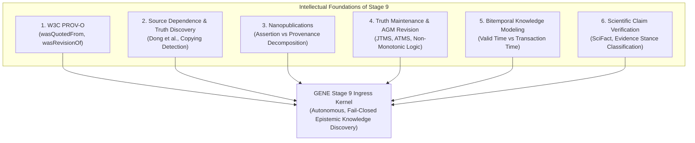

# Research Synthesis: Stage 9 Intellectual Archaeology (Claims, Provenance & Truth Maintenance)

> **Classification**: `RESEARCH SYNTHESIS — INTELLECTUAL ARCHAEOLOGY`  
> **Target System**: GENE (Autonomous Epistemic Knowledge Discovery)  
> **Scope**: Prior Art Survey, Theoretical Foundations & Uniquely GENE Epistemics  
> **Authors**: Antigravity, ChatGPT Pro, Human Research Director  

---

## Executive Summary

Stage 8 proved that hybrid neural-symbolic ingress can safely ground entity existence and identity.  
As GENE prepares to climb to **Stage 9 (Claims, Evidence, Contradiction, and Supersession)**, this document conducts an "intellectual archaeology" of existing literature across six major computer science lineages.

The goal is to determine: **What has already been formally solved, and what is uniquely GENE's moonshot challenge?**

---

## 1. Lineage 1: Provenance Ontologies (W3C PROV-O & PROV-DM)

### Foundational Prior Art
The **W3C PROV Data Model (PROV-DM)** and its OWL2 ontology **PROV-O** (Lebo et al., 2013) formalize how information artifacts evolve. Crucially, PROV-O refines the generic derivation property `prov:wasDerivedFrom` into three specialized subproperties:

1. `prov:hadPrimarySource`: Connects an assertion to the direct empirical observation or primary document that generated it.
2. `prov:wasRevisionOf`: Explicitly declares that a new entity or statement is an updated version of a prior entity, implying temporal supersession.
3. `prov:wasQuotedFrom`: Indicates that an entity repeats, excerpts, or cites an existing source.

### What is Solved vs What is Uniquely GENE
- **Solved**: Standardized semantic vocabulary for tracking derivation, agents, and activities.
- **Uniquely GENE**: PROV-O is descriptive and passive; it does not adjudicate contradiction, enforce fail-closed mutation boundaries, or prevent autonomous language models from hallucinating false derivation edges. GENE must implement an *active epistemic kernel* that enforces these invariants during live streaming ingress.

---

## 2. Lineage 2: Source Dependence & Truth Discovery (Dong et al.)

### Foundational Prior Art
In data fusion, classical models assumed data sources were independent. **Xin Luna Dong, Laure Berti-Equille, and Divesh Srivastava** (PVLDB 2009, 2010) proved that web sources frequently copy from one another without independent verification:

$$\text{Confidence}(C) \neq \sum_{i=1}^N \text{Weight}(\text{Source}_i) \quad \text{if } \text{Source}_j \text{ copied from } \text{Source}_i$$

Their Bayesian truth discovery framework detects copying dependencies and penalizes "citation echoes" to prevent false facts from accumulating massive artificial confidence.

### The GENE Connection: Preventing Echo-Chamber Overconfidence
In scientific literature, citation cascades are pervasive:
$$\text{Paper A measures } X \xrightarrow{\text{cites}} \text{Paper B reports } X \xrightarrow{\text{cites}} \text{Paper C reports } X$$
If an autonomous agent treats Papers A, B, and C as three independent empirical confirmations of $X$, it creates catastrophic epistemic distortion.

- **GENE Rule**: A claim's empirical weight is bounded by its **independent primary sources** (`prov:hadPrimarySource`), while citation edges (`prov:wasQuotedFrom`) serve strictly as propagation telemetry.

---

## 3. Lineage 3: Nanopublications & Multi-Source Assertion Graphs

### Foundational Prior Art
Groth, Gibson, and Velterop (2010), later refined by Kuhn et al. (2013, 2021), introduced **Nanopublications** to deconstruct monolithic scientific papers into minimal machine-readable triplets:

$$\text{Nanopublication} = \langle \text{Assertion}, \text{Provenance}, \text{PublicationInfo} \rangle$$

Each assertion is encapsulated in an immutable, cryptographically hashed named graph.

### What is Solved vs What is Uniquely GENE
- **Solved**: Atomic decomposition of scientific discourse into fine-grained assertion bundles with explicit attribution.
- **Uniquely GENE**: Nanopublications assume humans author well-formed RDF statements. GENE must extract these assertions autonomously from noisy natural-language telemetry and code while maintaining a deterministic fail-closed boundary when extractions are ambiguous.

---

## 4. Lineage 4: Truth Maintenance Systems (TMS) & Belief Revision (AGM)

### Foundational Prior Art
- **Doyle's Justification-based TMS (JTMS, 1979)**: Maintains beliefs with explicit justifications (`IN` / `OUT` status).
- **de Kleer's Assumption-based TMS (ATMS, 1986)**: Maintains multiple competing contexts simultaneously, recording which minimal set of assumptions supports each belief.
- **AGM Postulates (Alchourrón, Gärdenfors, Makinson, 1985)**: Formalized the axioms of rational belief revision (Success, Inclusion, Vacuity, Consistency, Recovery).

### The Epistemic Gap
Classical belief revision assumes a monotonic notion of truth where discovering a contradiction triggers retraction. In empirical science, observations are immutable: a retracted paper or a refuted hypothesis was still genuinely asserted at timestamp $T$.

- **GENE Invariant**: GENE never deletes or retracts historical execution records; it updates their *epistemic status* (e.g. `HISTORICAL_SUPERSEDED`, `CONTRADICTION_UNRESOLVED`) while preserving full bitemporal auditability.

---

## 5. Lineage 5: Temporal Knowledge Graphs & Bitemporal Modeling

### Foundational Prior Art
Snodgrass, Jensen, and the SQL:2011 temporal standard formalized **Bitemporal State**:

1. **Valid Time ($T_v$)**: The time period during which a fact is true in the real world (e.g., *"Router Alpha had 8 interfaces from 2024 to 2025"*).
2. **Transaction Time ($T_x$)**: The time period during which the fact was stored and believed by the database (e.g., *"Database recorded this fact on 2026-08-22"*).

### Application to Stage 9
This bitemporal separation completely resolves the false contradiction problem:
- Claim A: `(Cluster Alpha, node_count, 8, ValidTime: 2025)`
- Claim B: `(Cluster Alpha, node_count, 16, ValidTime: 2026)`
Because their **Valid Times** do not overlap, they are not a contradiction; Claim B is a valid **Temporal State Transition** (`prov:wasRevisionOf`).

---

## 6. Lineage 6: Scientific Claim Verification (SciFact & FEVER)

### Foundational Prior Art
- **FEVER (Thorne et al., NAACL 2018)**: General fact extraction and verification over Wikipedia.
- **SciFact (Wadden et al., EMNLP 2020)**: Expert scientific claim verification predicting evidence rationales and stance (`SUPPORT`, `CONTRADICT`, `NOT_ENOUGH_INFO`).

### What is Solved vs What is Uniquely GENE
- **Solved**: Neural architectures for cross-encoding claims against scientific text passages to predict local stance.
- **Uniquely GENE**: SciFact evaluates isolated (claim, abstract) pairs. It has no persistent relational database, no bitemporal state, no notion of entity disambiguation, and no operational authority to mutate a research repository's belief state.

---

## 7. Comparative Synthesis Matrix

| Literature Lineage | Key Conceptual Contribution | Solved by Prior Art | GENE Moonshot Challenge |
| :--- | :--- | :--- | :--- |
| **W3C PROV-O** | Derivation taxonomy (`wasQuotedFrom`, `wasRevisionOf`, `hadPrimarySource`) | Formal ontology & property semantics | Enforcing deterministic derivation gating on autonomous agent extractions. |
| **Truth Discovery (Dong)** | Copying detection & source dependence modeling | Bayesian penalty for citation echoes | Real-time discounting of secondary citations during streaming ingress. |
| **Nanopublications** | Subatomic decomposition of papers into Assertion + Provenance | Immutable assertion packaging | Autonomous natural-language extraction without RDF authoring friction. |
| **ATMS / AGM Revision** | Context maintenance & belief revision postulates | Non-monotonic dependency tracking | Bitemporal history preservation without deletion or loss of historical lineage. |
| **Bitemporal Modeling** | Valid Time vs Transaction Time decoupling | Relational time-interval algebra | Distinguishing temporal updates from direct factual contradictions. |
| **SciFact / FEVER** | Natural language evidence stance classification | 3-way stance prediction (`SUPPORT`, `CONTRADICT`) | Embedding stance models within a fail-closed, multi-tier database kernel. |

---

## 8. Concrete Takeaways for Stage 9 Design

1. **Adopt Bitemporal Claim Representation**: Every claim must carry both `valid_time_interval` and `transaction_timestamp`.
2. **Implement PROV-O Derivation Relations**: Explicitly tag claims as `PRIMARY_OBSERVATION` vs `QUOTED_CITATION` vs `REVISION_OF`.
3. **Discount Citation Echoes**: Do not increment confidence when multiple papers cite the same primary source.
4. **Separate Stance from State Mutation**: SciFact-style neural stance predictions are advisory proposals; deterministic bitemporal logic decides whether the mutation is a temporal update, contradiction, or supersession.
