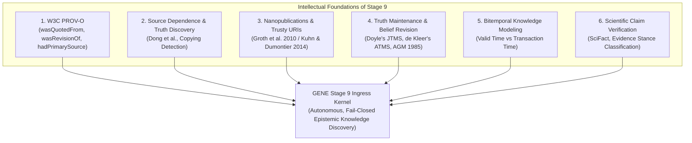

# Research Synthesis: Stage 9 Intellectual Archaeology (Claims, Provenance & Truth Maintenance)

> **Classification**: `RESEARCH SYNTHESIS — INTELLECTUAL ARCHAEOLOGY`  
> **Target System**: GENE (Autonomous Epistemic Knowledge Discovery)  
> **Scope**: Prior Art Survey, Theoretical Foundations & Uniquely GENE Epistemics  
> **Authors**: Antigravity, ChatGPT Pro, Human Research Director  

---

## Executive Summary

Stage 8 proved that hybrid neural-symbolic ingress can safely ground entity existence and identity.  
As GENE prepares to climb to **Stage 9 (Claims, Evidence, Contradiction, and Supersession)**, this document conducts an "intellectual archaeology" of existing literature across six major computer science lineages.

The goal is to determine: **What has already been formally solved, and what is uniquely GENE's moonshot challenge?**

---

## 1. Lineage 1: Provenance Ontologies (W3C PROV-O & PROV-DM)

### Foundational Prior Art
The **W3C PROV Data Model (PROV-DM)** and its OWL2 ontology **PROV-O** (Lebo et al., 2013) formalize how information artifacts evolve. Crucially, PROV-O refines the generic derivation property `prov:wasDerivedFrom` into three specialized subproperties:

1. `prov:hadPrimarySource`: Connects an entity or statement to an original artifact produced by an agent with direct, firsthand experience (e.g., sensor telemetry, contemporaneous experimental logs, or direct empirical reports).
2. `prov:wasRevisionOf`: Declares that an entity or statement is a revised version of a prior entity.
3. `prov:wasQuotedFrom`: Indicates that an entity repeats, excerpts, or quotes another entity (potentially across different authors).

### What is Solved vs What is Uniquely GENE
- **Solved**: Standardized semantic vocabulary for structural derivation, attribution, and quotations.
- **Uniquely GENE**: 
  - `prov:wasRevisionOf` records structural lineage, but **does not automatically decide epistemic supersession**. Whether a revised claim invalidates, deprecates, or narrows a prior claim's *current epistemic validity* is a domain decision that GENE's epistemic kernel must arbitrate.
  - PROV-O is descriptive and passive; it does not adjudicate contradiction or enforce fail-closed mutation boundaries during autonomous language-model ingestion.

---

## 2. Lineage 2: Source Dependence & Truth Discovery (Dong et al.)

### Foundational Prior Art
In data fusion, classical models assumed data sources were independent. **Xin Luna Dong, Laure Berti-Equille, and Divesh Srivastava** (PVLDB 2009, 2010) proved that web sources frequently copy from one another without independent verification:

$$\text{Confidence}(C) \neq \sum_{i=1}^N \text{Weight}(\text{Source}_i) \quad \text{if } \text{Source}_j \text{ copied from } \text{Source}_i$$

Their Bayesian truth discovery framework detects copying dependencies and penalizes redundant copiers to prevent false facts from accumulating massive artificial confidence.

### The GENE Adaptation: Preventing Citation-Echo Overconfidence
In scholarly discourse, citation cascades are pervasive:
$$\text{Paper A measures } X \xrightarrow{\text{cites}} \text{Paper B reports } X \xrightarrow{\text{cites}} \text{Paper C reports } X$$
If an autonomous agent treats Papers A, B, and C as three independent empirical confirmations of $X$, it creates severe epistemic distortion.

- **GENE Adaptation**: While Dong et al. formulated source dependence for web data extraction, **GENE adapts these principles to scholarly citation chains**. A claim's empirical weight is bounded by its **independent primary sources** (`prov:hadPrimarySource`), while citation edges (`prov:wasQuotedFrom`) serve strictly as propagation telemetry, preventing echo-chamber confidence multiplication.

---

## 3. Lineage 3: Nanopublications & Trusty URIs

### Foundational Prior Art
This lineage separates into two complementary innovations:
1. **Nanopublications (Groth, Gibson, Velterop 2010)**: Proposed deconstructing monolithic scientific papers into minimal machine-readable packages:
   $$\text{Nanopublication} = \langle \text{Assertion}, \text{Provenance}, \text{PublicationInfo} \rangle$$
2. **Trusty URIs (Kuhn & Dumontier 2014)**: Added cryptographic, content-addressable hash identifiers (e.g. SHA-256 digests) to make RDF named graphs and nanopublications immutable and independently verifiable.

### What is Solved vs What is Uniquely GENE
- **Solved**: Atomic assertion/provenance packaging (Nanopubs) and immutable content-addressable hashing (Trusty URIs).
- **Uniquely GENE**: Nanopublications assume human researchers author clean RDF triples. GENE must extract atomic assertions autonomously from unstructured telemetry and prose, assign bitemporal bounds, and handle cases where assertions are ambiguous, hypothetical, or incomplete.

---

## 4. Lineage 4: Truth Maintenance Systems (TMS) & Belief Revision (AGM)

### Foundational Prior Art
- **Doyle's Justification-based TMS (JTMS, 1979)** and **de Kleer's Assumption-based TMS (ATMS, 1986)**: Foundational **non-monotonic reasoning** systems explicitly engineered to maintain dependency networks, track assumptions, and revise which beliefs are currently labeled `IN` (accepted) or `OUT` (rejected) when discoveries contradict assumptions.
- **AGM Postulates (Alchourrón, Gärdenfors, Makinson, 1985)**: Defined formal axioms for belief change operations (Expansion, Contraction, Revision).

### The Epistemic Gap
Classical TMS and belief revision determine which beliefs should *currently* be accepted (`IN`/`OUT`). In empirical research repositories, however, historical truth is immutable: a retracted paper or a superseded hypothesis was still genuinely asserted and believed at timestamp $T$.

- **The GENE Architecture**: Combines non-monotonic current belief selection with **immutable assertion/provenance history and bitemporal epistemic status**. GENE never deletes historical beliefs; it transitions their epistemic status (`CURRENT_VALID` $\to$ `HISTORICAL_SUPERSEDED` or `CONTRADICTION_UNRESOLVED`) while preserving full justification lineage.

---

## 5. Lineage 5: Temporal Knowledge Graphs & Bitemporal Modeling

### Foundational Prior Art
Snodgrass, Jensen, and the SQL:2011 temporal standard formalized **Bitemporal State**:

1. **Valid Time ($T_v$)**: The time interval during which a fact was true in reality (e.g. *"Router Alpha had 8 interfaces from 2024 to 2025"*).
2. **Transaction Time ($T_x$)**: The time interval during which the database stored and believed the fact (e.g. *"Database recorded this fact on 2026-08-22"*).

### Application to Stage 9
Bitemporal modeling **provides a principled basis for distinguishing many temporal transitions from genuine same-context contradictions**:
- Claim A: `(Cluster Alpha, node_count, 8, ValidTime: [2024, 2025])`
- Claim B: `(Cluster Alpha, node_count, 16, ValidTime: [2026, ∞))`
Because their **Valid Times** do not overlap, they are not a contradiction; Claim B is a valid **Temporal State Transition** (`prov:wasRevisionOf`).

*Nuance*: Bitemporality provides the foundation, but real-world telemetry also includes retroactive corrections, out-of-order logs, and uncertain intervals, requiring GENE to support bitemporal state machines with explicit confidence decay.

---

## 6. Lineage 6: Scientific Claim Verification (SciFact & FEVER)

### Foundational Prior Art
- **FEVER (Thorne et al., NAACL 2018)**: Fact extraction and verification over Wikipedia.
- **SciFact (Wadden et al., EMNLP 2020)**: Expert scientific claim verification predicting evidence rationales and stance (`SUPPORT`, `CONTRADICT`, `NOT_ENOUGH_INFO`).

### What is Solved vs What is Uniquely GENE
- **Solved**: Neural architectures for cross-encoding natural language claims against text passages to predict local stance.
- **Uniquely GENE**: SciFact evaluates isolated (claim, abstract) pairs. It has no persistent relational database, no bitemporal state, no entity disambiguation, and no operational authority to mutate a research repository's belief state.

---

## 7. Comparative Synthesis Matrix

| Literature Lineage | Key Conceptual Contribution | Solved by Prior Art | GENE Moonshot Challenge |
| :--- | :--- | :--- | :--- |
| **W3C PROV-O** | Derivation taxonomy (`wasQuotedFrom`, `wasRevisionOf`, `hadPrimarySource`) | Structural derivation vocabulary | Arbitrating epistemic supersession during live streaming LLM ingress. |
| **Truth Discovery (Dong)** | Copying detection & source dependence modeling | Source-dependence modeling in data fusion | Adapting copying detection to scholarly citation chains and primary observations. |
| **Nanopubs & Trusty URIs** | Assertion/Provenance packaging + Content-addressable hashing | Atomic packaging & cryptographic URIs | Autonomous natural-language extraction into verifiable atomic assertion records. |
| **ATMS / AGM Revision** | Non-monotonic belief revision & context maintenance | Dependency networks & `IN`/`OUT` labeling | Unifying non-monotonic belief selection with immutable bitemporal assertion history. |
| **Bitemporal Modeling** | Valid Time vs Transaction Time decoupling | Relational time-interval algebra | Distinguishing temporal updates from direct contradictions under streaming uncertainty. |
| **SciFact / FEVER** | Natural language evidence stance classification | 3-way stance prediction (`SUPPORT`, `CONTRADICT`) | Embedding stance proposals within a fail-closed, multi-tier database kernel. |
