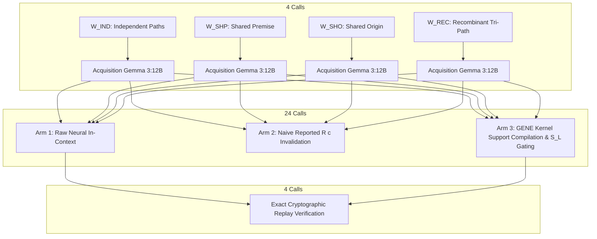

# Exploration Round 5 Stage 5C: Neural Revision Bridge Report

**Assay Tag**: `round5-stage5c-runner-freeze` $\to$ `round5-stage5c-postreview-freeze`  
**Execution Commit**: `4203e91c70a0eead8c36def4a7dcfcab53fd584b`  
**Manifest SHA-256**: `ce963fde7e1771bb16a31209fdda84777596d567bc08b9079252dd58c5cf3f8e`  
**Target Model**: `gemma3:12b` (Digest: `f4031aab637d1ffa37b42570452ae0e4fad0314754d17ded67322e4b95836f8a`)  
**Ollama Version**: `0.32.15`  
**Raw Execution DB**: `data/exploration_round5_stage5c_results.db` (SHA-256: `47d12f895eba118a8a209f221a9850f6b19f146104df9e9f8ed2be71370d4dba`)  
**Lossless JSON Runs Export**: `data/exploration_round5_stage5c_runs.json` (SHA-256: `3be0fd4cf9376f601bfbcb7b393d1b348de66f698a53ee52312cef77ee87fa01`)  
**Lossless JSONL Calls Export**: `data/exploration_round5_stage5c_calls.jsonl` (SHA-256: `c7b6e8278e283f29ea974cb3b09e258a295fa59fd9f8153e1d64a219700d533a`)  
**Summary JSON**: `data/exploration_round5_stage5c_summary.json` (SHA-256: `568a0135941316019b7885dc482dade4843e73b985a2125fd28025a24a66be1e`)  
**Execution Parameters**: Temperature `0.0`, Seed `42`, Format `json`, Total Calls `32`, Elapsed Time `82.24s` ($2.57\text{s/call}$)

---

## Executive Summary

Stage 5C connects the formal mathematical theory of support algebra (Stage 5A) and lineage-projected action governance (Stage 5B) to live neural inference in a **preregistered 32-call factorial assay** on `gemma3:12b`.

The empirical results reveal that belief maintenance under change is vulnerable to **two distinct failure channels**:
1. **Unassisted Neural Revision Failure**: Raw neural reasoning fails to resolve support boundaries accurately under perturbation, over-retracting valid beliefs in $2/4$ degraded worlds ($50\%$).
2. **Lossy Reported-Dependency Policy Failure**: Naïve dependency tracking over self-reported acquisition citations ($R(c)$) triggers retraction in $3/4$ degraded worlds ($75\%$) and introduces $2/4$ marginal errors beyond the neural baseline.

The combined naïve runtime (Arm 2) suffered **$100\%$ degraded-state failure** ($0/4$ retention). In contrast, the **GENE Support-First Epistemic Runtime (Arm 3)** eliminated both failure channels entirely, achieving **$100.0\%$ overall entitlement accuracy** ($8/8$), **$100.0\%$ degraded-state belief retention** ($4/4$), and **$100.0\%$ clean abstention under complete retraction** ($4/4$).

Furthermore, in a multi-path recombinant world ($W_{\text{REC}}$), the system cleanly demonstrated **dual-layer containment**: preserving logical belief entitlement via a surviving proof path while the preregistered lineage gate blocked operational action execution due to structural root-lineage degradation.

```
+===================================================================================================+
|                                    STAGE 5C FACTORIAL OUTCOMES                                    |
+======================+=========================+========================+=========================+
| Metric               | Arm 1 (Raw Neural)      | Arm 2 (Naïve Reported) | Arm 3 (GENE Kernel)     |
+======================+=========================+========================+=========================+
| Overall Entitlement  | 75.0% (6/8)             | 50.0% (4/8)            | 100.0% (8/8)            |
| Degraded Active Rate | 50.0% (2/4)             | 0.0% (0/4) [100% Fail] | 100.0% (4/4)            |
| Retracted Abstention | 100.0% (4/4)            | 100.0% (4/4)           | 100.0% (4/4)            |
| Lineage Action Gate  | N/A (Unchecked)         | N/A (Premature Revoke) | Preregistered Enforced  |
+======================+=========================+========================+=========================+
```

---

## 1. Experimental Design & Bounded Micro-Worlds

The assay evaluated 4 canonical micro-world geometries across 3 sequential phases:



### Micro-World Geometries:
1. **$W_{\text{IND}}$ (Independent Alternatives)**:
   - Initial Support: $\mathcal{S} = \{\{A, B\}, \{D, E\}\}$, Roots: $\mathcal{S}_L = \{\{R1\}, \{R2\}\}$.
   - Degraded: $\text{do}(D=0) \to \text{Surviving } \mathcal{S}' = \{\{A, B\}\}, \mathcal{S}_L' = \{\{R1\}\}, \text{Auth}=0.50$.
   - Retracted: $\text{do}(A=0, D=0) \to \text{Surviving } \mathcal{S}' = \emptyset, \mathcal{S}_L' = \emptyset, \text{Auth}=0.00$.
2. **$W_{\text{SHP}}$ (Shared Premise Alternatives / $\kappa$-Blindness Boundary)**:
   - Initial Support: $\mathcal{S} = \{\{A, B\}, \{A, D\}\}$, Roots: $\mathcal{S}_L = \{\{R1, R2\}, \{R1, R3\}\}$.
   - Degraded: $\text{do}(B=0) \to \text{Surviving } \mathcal{S}' = \{\{A, D\}\}, \mathcal{S}_L' = \{\{R1, R3\}\}, \text{Auth}=0.75$.
   - Retracted: $\text{do}(A=0) \to \text{Surviving } \mathcal{S}' = \emptyset, \mathcal{S}_L' = \emptyset, \text{Auth}=0.00$.
3. **$W_{\text{SHO}}$ (Shared Origin Ancestry / $\rho_L$ Collision Boundary)**:
   - Initial Support: $\mathcal{S} = \{\{A, B\}, \{D, E\}\}$, Roots: $\mathcal{S}_L = \{\{R1, R2\}\}$ (single shared root set).
   - Degraded: $\text{do}(D=0) \to \text{Surviving } \mathcal{S}' = \{\{A, B\}\}, \mathcal{S}_L' = \{\{R1, R2\}\}, \text{Auth}=0.75$.
   - Retracted: $\text{do}(A=0, D=0) \to \text{Surviving } \mathcal{S}' = \emptyset, \mathcal{S}_L' = \emptyset, \text{Auth}=0.00$.
4. **$W_{\text{REC}}$ (Recombinant Tri-Path)**:
   - Initial Support: $\mathcal{S} = \{\{A, B\}, \{B, C\}, \{C, D\}\}$, Roots: $\mathcal{S}_L = \{\{R1, R2\}, \{R2, R3\}, \{R3, R4\}\}$.
   - Degraded: $\text{do}(A=0, B=0) \to \text{Surviving } \mathcal{S}' = \{\{C, D\}\}, \mathcal{S}_L' = \{\{R3, R4\}\}, \text{Auth}=0.417$.
   - Retracted: $\text{do}(B=0, C=0) \to \text{Surviving } \mathcal{S}' = \emptyset, \mathcal{S}_L' = \emptyset, \text{Auth}=0.00$.

---

## 2. Acquisition Analysis ($G_0$): Rich Support Typology

In Phase 1 acquisition, Gemma 3:12B achieved $100\%$ semantic accuracy across all 4 micro-worlds with valid JSON schema conformance. However, the self-reported citation vectors $R(c)$ exhibited a rich structural typology:

| World | Ground Truth Answer | Model Output Answer | Reported Citations $R(c)$ | Structural Typology | Epistemic Limitation |
|---|---|---|---|---|---|
| **$W_{\text{IND}}$** | `PROTOCOL_OMEGA` | `PROTOCOL_OMEGA` | `[FACT_IND_A, FACT_IND_B, FACT_IND_D, FACT_IND_E]` | **Overcomplete / Explanatory Bloat** | Cites all 4 premises across both alternative paths |
| **$W_{\text{SHP}}$** | `TIER_SIGMA` | `TIER_SIGMA` | `[FACT_SHP_A]` | **Undercomplete / Insufficient** | Cites only $A$ ({A} is not a valid Horn derivation on its own) |
| **$W_{\text{SHO}}$** | `CODE_EPSILON` | `CODE_EPSILON` | `[FACT_SHO_A, FACT_SHO_B, FACT_SHO_D, FACT_SHO_E]` | **Overcomplete / Explanatory Bloat** | Cites all 4 premises across both alternative paths |
| **$W_{\text{REC}}$** | `LANE_THETA` | `LANE_THETA` | `[FACT_REC_A, FACT_REC_B]` | **Single Exact Witness** | Cites Path 1 only; locally minimal but globally incomplete |

This demonstrates that neural justification $R(c)$ is not an idealized minimal support representation: it can be **too large** (bloated), **too small** (undercomplete), or **locally sufficient but globally incomplete** for multi-path reasoning under future change.

---

## 3. Factorial Revision Outcomes: The Two Failure Channels

```
+========================================================================================================================+
|                                    DEGRADED-STATE MECHANISM DECOMPOSITION                                              |
+===========+=====================+====================+======================+====================+=====================+
| World     | Acquisition R(c)    | Raw Neural (Arm 1) | Naïve Trigger (R∩I)  | Combined Naïve (2) | GENE Kernel (Arm 3) |
+===========+=====================+====================+======================+====================+=====================+
| W_IND     | All 4 Facts         | ACTIVE (Correct)   | YES (Intersect D)    | RETRACT (Fail)     | ACTIVE (Correct)    |
| W_SHP     | {A} Only            | ABSTAIN (Fail)     | NO  (Disjoint B)     | ABSTAIN (Fail)     | ACTIVE (Correct)    |
| W_SHO     | All 4 Facts         | ACTIVE (Correct)   | YES (Intersect D)    | RETRACT (Fail)     | ACTIVE (Correct)    |
| W_REC     | {A, B}              | ABSTAIN (Fail)     | YES (Intersect A, B) | RETRACT/ABST (Fail)| ACTIVE (Correct)    |
+===========+=====================+====================+======================+====================+=====================+
```

### Channel Decomposition Summary:
1. **Naïve Policy Trigger Rate on Degraded States**: **$3/4$ ($75.0\%$)**.
2. **Raw Neural Failure Rate on Degraded States**: **$2/4$ ($50.0\%$)**.
3. **Marginal Additional Policy-Induced Error Rate**: **$2/4$ ($50.0\%$)** (in $W_{\text{IND}}$ and $W_{\text{SHO}}$, where raw neural succeeded but the policy killed the belief).
4. **Failure Modality Categorization**:
   - **Policy-Only Failure**: $W_{\text{IND}}, W_{\text{SHO}}$ ($2/4 = 50\%$).
   - **Neural-Only Failure**: $W_{\text{SHP}}$ ($1/4 = 25\%$).
   - **Both Channels Overlap**: $W_{\text{REC}}$ ($1/4 = 25\%$).

### Key Insights:

- **The Neural Support-Boundary Resolution Phenomenon (Arm 1)**:
  Under unassisted in-context revision, Gemma exhibited $P(\text{UNKNOWN}\mid\text{RETRACTED}) = 4/4$ but $P(\text{ACTIVE}\mid\text{DEGRADED}) = 2/4$. In $W_{\text{SHP}}$ and $W_{\text{REC}}$, the raw model became overly conservative, returning `INDETERMINABLE` despite valid surviving alternative paths. Neural belief maintenance suffers from poor support-boundary resolution: depending on context framing, models can either hallucinate pseudo-paths from broken evidence (as observed in Exp 1B-C2) or fail to detect valid paths under retraction noise.
  
- **Exploratory Salience Association**:
  In all 4 worlds, there was an exact correlation between whether acquisition $R(c)$ contained the surviving path and whether the raw model retained it:
  - $W_{\text{IND}}$ (bloat included $AB$) $\to$ raw model retained $AB$.
  - $W_{\text{SHO}}$ (bloat included $AB$) $\to$ raw model retained $AB$.
  - $W_{\text{SHP}}$ ($R(c)=\{A\}$, omitted surviving path $AD$) $\to$ raw model abstained.
  - $W_{\text{REC}}$ ($R(c)=\{AB\}$, omitted surviving path $CD$) $\to$ raw model abstained.
  *(Note: This is an exploratory observation on $N=4$ fixtures where topology is confounded; it suggests future experiments on representation salience).*

- **End-to-End Runtime Architecture (Arm 3)**:
  By enumerating minimal Horn support $\mathcal{S}_F(c)$ and compiling only active entitling facts into prompt context, the GENE runtime restored **$100.0\%$ degraded retention ($4/4$)** and **$100.0\%$ retracted abstention ($4/4$)**. This represents an architectural system result where support compilation filters out invalidation noise.

---

## 4. Preregistered Lineage-Thresholded Action Governance

In Arm 3, the Epistemic Kernel evaluated action authorization via the lineage-projected governance metric $\text{Auth}(\mathcal{S}_L')$ against the preregistered threshold $\tau = 0.50$:

$$\text{Auth}(\mathcal{S}_L') = \frac{1}{2} \left( \frac{\kappa_L'}{\kappa_{\text{init}}} + \frac{|\mathcal{S}_L'|}{|\mathcal{S}_{\text{init}}|} \right)$$

| World | Condition | Model Proposed Action | Confidence | Authority $\text{Auth}(\mathcal{S}_L')$ | Threshold $\tau$ | Gate Verdict | Executed Action |
|---|---|---|---|---|---|---|---|
| **$W_{\text{IND}}$** | `DEGRADED` | `Confirm operating protocol...` | $0.95$ | **$0.500$** | $0.50$ | **`PERMIT`** | Executed |
| **$W_{\text{IND}}$** | `RETRACTED` | `null` | $0.95$ | **$0.000$** | $0.50$ | **`N/A`** | `null` |
| **$W_{\text{SHP}}$** | `DEGRADED` | `Verify Tier Assignment` | $0.95$ | **$0.750$** | $0.50$ | **`PERMIT`** | Executed |
| **$W_{\text{SHP}}$** | `RETRACTED` | `null` | $0.95$ | **$0.000$** | $0.50$ | **`N/A`** | `null` |
| **$W_{\text{SHO}}$** | `DEGRADED` | `Grant access with CODE_EPSILON`| $0.95$ | **$0.750$** | $0.50$ | **`PERMIT`** | Executed |
| **$W_{\text{SHO}}$** | `RETRACTED` | `null` | $0.95$ | **$0.000$** | $0.50$ | **`N/A`** | `null` |
| **$W_{\text{REC}}$** | `DEGRADED` | `route_transit` | $0.95$ | **$0.417$** | $0.50$ | **`BLOCK`** | **`null` (Blocked)** |
| **$W_{\text{REC}}$** | `RETRACTED` | `null` | $0.95$ | **$0.000$** | $0.50$ | **`N/A`** | `null` |

### Discovery 10: Dual-Layer Containment & Decoupled Action Authority
In $W_{\text{REC}}$, the assay produced a clean separation of three epistemic tiers:
1. **Logical Entitlement**: Claim remains deductively entitled ($\mathcal{S}' = \{\{C, D\}\}$).
2. **Model Self-Reported Confidence**: Model expressed high internal confidence ($0.95$).
3. **Lineage Epistemic Authority**: Kernel calculated that 2 of 3 paths and 2 of 4 roots were destroyed, yielding $\text{Auth} = 0.417 < 0.50$.

The gate enforced policy conformance by permitting the belief deduction while **blocking external action execution**, proving that persistent systems can decouple internal belief revision from high-stakes operational authorization.

---

## 5. Replay Stability & Realization Nondeterminism

The execution confirmed the separation between realization-layer tokens and semantic epistemic states:

1. **Replay Canaries ($N=4$)**:
   - Exact Prompt Hash Match: **$4/4$ ($100.0\%$)**
   - Raw Token-Level Response Match: **$3/4$ ($75.0\%$)**
   - Semantic Epistemic Answer Match: **$4/4$ ($100.0\%$)**

2. **Paired Arm 1 vs Arm 2 Conditions ($N=8$, identical prompts)**:
   - Exact Prompt Hash Match: **$8/8$ ($100.0\%$)**
   - Raw Token-Level Match: **$3/8$ ($37.5\%$)**
   - Semantic Epistemic Match: **$8/8$ ($100.0\%$)**

This confirms that under local GPU execution with greedy decoding ($T=0$), token-level nondeterminism can occur at the realization layer while the semantic epistemic state remains strictly invariant.

---

## 6. Scope Limitations & Methodological Constraints

1. **Bounded Rule Enumeration**: The support enumeration in Stage 5C performs bounded direct rule-antecedent enumeration over shallow first-order Horn worlds. It is an epistemic context compiler for structured agent memory, not a general-purpose automated theorem prover.
2. **Architectural Bridge vs Component Ablation**: Stage 5C evaluated the end-to-end support-first runtime package (filtering invalid facts, minimal context compilation, and lineage gating). It validates the runtime architecture rather than isolating individual prompt tokens.
3. **Lineage Authenticity Assumption**: Lineage metadata was faithfully recorded by the harness. Adversarial provenance manipulation over deep multi-agent chains remains future work.

---

## 7. Archived Evidence & Artifact Provenance

All raw telemetry is losslessly preserved in the repository tree:
- **Execution Run Record**: [`data/exploration_round5_stage5c_runs.json`](../../data/exploration_round5_stage5c_runs.json) (SHA-256: `3be0fd4cf9376f601bfbcb7b393d1b348de66f698a53ee52312cef77ee87fa01`)
- **Full Call Telemetry**: [`data/exploration_round5_stage5c_calls.jsonl`](../../data/exploration_round5_stage5c_calls.jsonl) (SHA-256: `c7b6e8278e283f29ea974cb3b09e258a295fa59fd9f8153e1d64a219700d533a`)
- **Aggregated Metrics**: [`data/exploration_round5_stage5c_summary.json`](../../data/exploration_round5_stage5c_summary.json) (SHA-256: `568a0135941316019b7885dc482dade4843e73b985a2125fd28025a24a66be1e`)
- **Execution Commit**: `4203e91c70a0eead8c36def4a7dcfcab53fd584b`
- **Assay Release Tag**: `round5-stage5c-postreview-freeze`
